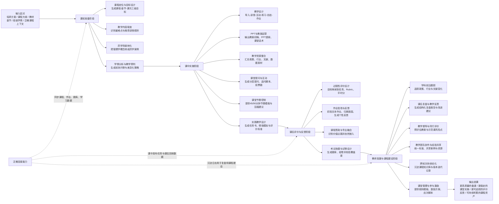

# CoursePilot Agent 教学环节作用流程图

下面这张图基于当前项目中定义的工作流与 20 个教学痛点整理，适合用于展示产品在教学全流程中的切入位置。

## 展示时可配套的一句话说明

CoursePilot Agent 不是只服务某一个单点任务，而是沿着“课前备课 - 课中实施 - 课后评价 - 持续改进”整条教学链路介入，把新教师最容易卡住的环节串成一个可执行、可反馈、可沉淀的闭环。
